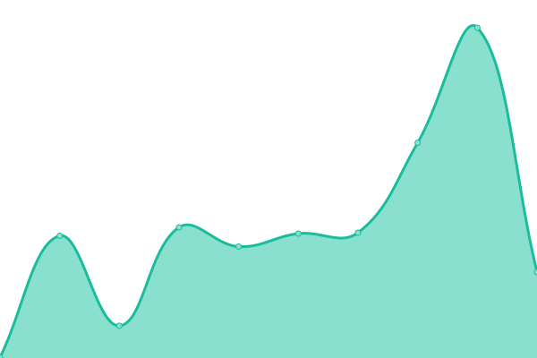
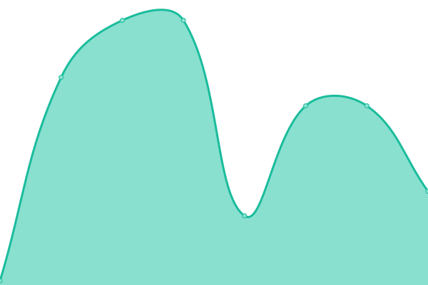

# [📈 Live Status](https://status.wickedcpu.com): <!--live status--> **🟧 Partial outage**

This repository contains the open-source uptime monitor and status page for [WickedCPU](https://wickedcpu.com), powered by [Upptime](https://github.com/upptime/upptime).

With [Upptime](https://upptime.js.org), you can get your own unlimited and free uptime monitor and status page, powered entirely by a GitHub repository. We use [Issues](https://github.com/upptime/upptime/issues) as incident reports, [Actions](https://github.com/empmdk/upptime/actions) as uptime monitors, and [Pages](https://status.wickedcpu.com) for the status page.

<!--start: status pages-->
<!-- This summary is generated by Upptime (https://github.com/upptime/upptime) -->
<!-- Do not edit this manually, your changes will be overwritten -->
<!-- prettier-ignore -->
| URL | Status | History | Response Time | Uptime |
| --- | ------ | ------- | ------------- | ------ |
|  [Wicked CPU (Homepage)](wickedcpu.com) | 🟩 Up | [wicked-cpu-homepage.yml](https://github.com/empmdk/upptime/commits/HEAD/history/wicked-cpu-homepage.yml) | 

 448ms
     
 | 

<a href="https://status.wickedcpu.com/history/wicked-cpu-homepage">100.00%</a>
    

|  [Wicked CPU (Play Dashboard)](play.wickedcpu.com) | 🟥 Down | [wicked-cpu-play-dashboard.yml](https://github.com/empmdk/upptime/commits/HEAD/history/wicked-cpu-play-dashboard.yml) | 

 219ms
     
 | 

<a href="https://status.wickedcpu.com/history/wicked-cpu-play-dashboard">0.00%</a>
    

|  [Playground01 (Game Server)](pg01.wickedcpu.com) | 🟥 Down | [playground01-game-server.yml](https://github.com/empmdk/upptime/commits/HEAD/history/playground01-game-server.yml) | 

 107ms
     
 | 

<a href="https://status.wickedcpu.com/history/playground01-game-server">86.41%</a>
    

<!--end: status pages-->

[**Visit our status website →**](https://status.wickedcpu.com)

## 📄 License

- Code: [MIT](./LICENSE) © [Upptime](https://upptime.js.org)
- Data in the `./history` directory: [Open Database License](https://opendatacommons.org/licenses/odbl/1-0/)
