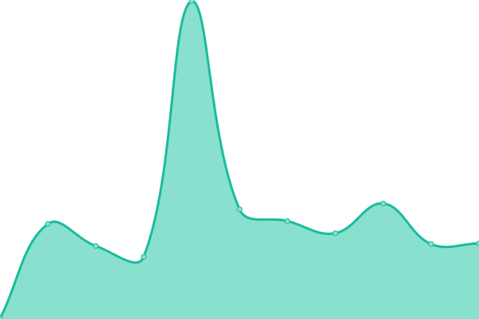
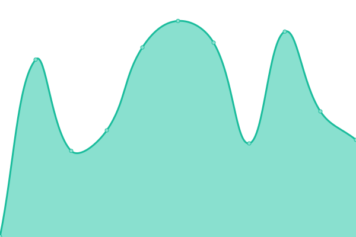

# [📈 Live Status](https://status.wickedcpu.com): <!--live status--> **🟩 All systems operational**

This repository contains the open-source uptime monitor and status page for [WickedCPU](https://wickedcpu.com), powered by [Upptime](https://github.com/upptime/upptime).

With [Upptime](https://upptime.js.org), you can get your own unlimited and free uptime monitor and status page, powered entirely by a GitHub repository. We use [Issues](https://github.com/upptime/upptime/issues) as incident reports, [Actions](https://github.com/upptime/upptime/actions) as uptime monitors, and [Pages](https://status.wickedcpu.com) for the status page.

<!--start: status pages-->
<!-- This summary is generated by Upptime (https://github.com/upptime/upptime) -->
<!-- Do not edit this manually, your changes will be overwritten -->

| URL                                                 | Status | History                                                                                                                 | Response Time                                                                                  | Uptime                                                                                                                                                                                                                                       |
| --------------------------------------------------- | ------ | ----------------------------------------------------------------------------------------------------------------------- | ---------------------------------------------------------------------------------------------- | -------------------------------------------------------------------------------------------------------------------------------------------------------------------------------------------------------------------------------------------- |
| [Wicked CPU (Homepage)](wickedcpu.com)              | 🟩 Up  | [wicked-cpu-homepage.yml](https://github.com/empmdk/upptime/commits/master/history/wicked-cpu-homepage.yml)             |  374ms       |              |
| [Wicked CPU (Play Dashboard)](play.wickedcpu.com)   | 🟩 Up  | [wicked-cpu-play-dashboard.yml](https://github.com/empmdk/upptime/commits/master/history/wicked-cpu-play-dashboard.yml) |  387ms |  |
| [Playground01 (Game Server)](http://172.107.199.10) | 🟩 Up  | [playground01-game-server.yml](https://github.com/empmdk/upptime/commits/master/history/playground01-game-server.yml)   |  8ms    |    |

<!--end: status pages-->

[**Visit our status website →**](https://status.wickedcpu.com)

## 📄 License

- Code: [MIT](./LICENSE) © [Upptime](https://upptime.js.org)
- Data in the `./history` directory: [Open Database License](https://opendatacommons.org/licenses/odbl/1-0/)
